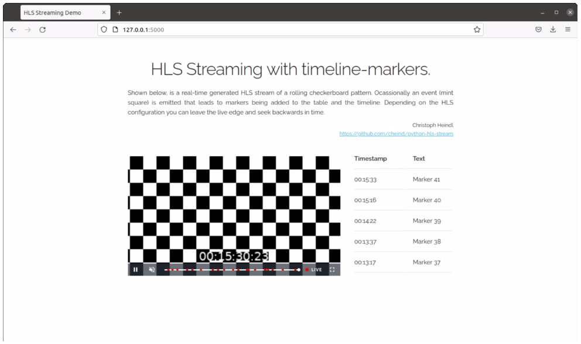

# python-hls-stream

A minimal proo-of-concept to demonstrate real-time (seekable) HLS streaming from Python with dynamic timeline marker support.

<div align="center">
<a href="https://www.youtube.com/watch?v=kCIO3IHkXrY"></a><br/>
<sup>Front-end of HLS streaming demo. Click to view video.</sup>
</div>

The video linked above shows how a real-time HTTP Live Streaming (HLS) can be generated and streamed from Python. Ocassionally an event (mint square) is emitted that leads to markers being added to the table and the timeline. Depending on the HLS configuration you can leave the live edge and seek backwards in time.

## Architecture
The system combines multiple processes to generated the desired result, each implimented as a Python module
 - `hlsstream.sync` key/value cache for inter-process communication based on `multiprocessing.SyncManager`.
 - `hlsstream.stream` generates the checkerboard images and encodes them as HLS stream using `ffmpeg`. Additionally, events (mint squares) are randomly emitted and stored in the cache as time/text dict.
 - `hlsstream.api` a web-API that exposes the HLS stream plus  a marker query API using `fastAPI`.  Additionally it serves `index.html` that contains an embedded video-player along with business logic for handling markers.


 ## Limitations
 Keep in mind, this is a proof-of-concept and thus expect glitches and other issues.
  - `hlsstream.sync` for production you should switch this for `redis` or `memcached`.
  - `hlsstream.stream` event (mint-square) detection is currently not based on computer-vision but based on checkerboard generator knowledge. In reality, you will have separate detection services that read images and emit marker events.
  - `hlsstream.stream` HLS stream encoder expects `rawvideo` (images) input. Except for setting a target FPS, I did not find a way to provide a PTS per frame. Hence, `ffmpeg` assumes `1/FPS` between two frames, even if reality the FPS varies. To resolve, you should keep track of generator timestamps vs target timestamps and if an event needs to be generated, convert from generator timestamp to target timestamp. The demo currently employs a busy-waiting strategy to keep timestamps closest to target fps. This leads to high CPU usage.
  - `hlsstream.api` currently configures CORS very carelessly. In production you will need to restrict it accordingly.
  - `index.html` attempts to determine the endpoints of the timeline of the `video-js` player. The current method seems to work when live or when not tracking the live stream, but might fail when `hlsstream.stream` is terminated. A refresh should fix things.


  ## Usage
  Python 3.9 is required. This should work on linux/windows.
  ```bash
  $ pip -m venv --upgrade-deps .venv
  $ source .venv/bin/activate
  (.venv) $ pip install pip-tools
  (.venv) $ pip-sync requirements.txt dev-requirements.txt
  (.venv) $ python -m hlsstream
  ```

  Point your browser to `http://127.0.0.1:5000`. Same commands, except for how to activate the venv, apply to Windows.
